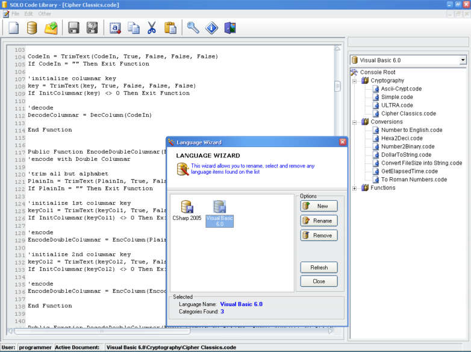



## A CODE LIBRARY by Solomon Manalo

### Description

Hello!, this is my first submission on PLANET-SOURCE-CODE. This application entitled "SOLO CODE Library" is intended to help programmers and the like to manage their codes perfectly.

This software, unlike any other "code library" found on Planet-source-code. has these features:

1. Security

2. File and folder Creation

*Once you create a code file and saves it, it will not be saved in microsoft access database or XML, but instead it creates its own file with an extension of ".code"

3. Friendly Interface

4. etc.

SPECIAL THANKS TO THE AUTHOR of THE FF:

1. McToolBar

2. LaVolpe Button

Thanks.........

PLEASE VOTE!!!!!!!!!!!!!!!!!

PLEASE VOTE!!!!!!!!!!!!!!!!!
 
### More Info
 
Extract it and Read the text file named: "USERNAME AND PASSWORD.txt"

             |
---                |---
**Submitted On**   |2007-04-11 14:17:16
**By**             |[Solomon Reyes Manalo](https://github.com/Planet-Source-Code/PSCIndex/blob/master/ByAuthor/solomon-reyes-manalo.md)
**Level**          |Intermediate
**User Rating**    |4.7 (98 globes from 21 users)
**Compatibility**  |VB 5\.0, VB 6\.0, VBA MS Access, VBA MS Excel
**Category**       |[Complete Applications](https://github.com/Planet-Source-Code/PSCIndex/blob/master/ByCategory/complete-applications__1-27.md)
**World**          |[Visual Basic](https://github.com/Planet-Source-Code/PSCIndex/blob/master/ByWorld/visual-basic.md)
**Archive File**   |[SOLO\_CODE\_2059694112007\.zip](https://github.com/Planet-Source-Code/solomon-reyes-manalo-a-code-library-by-solomon-manalo__1-68329/archive/master.zip)

